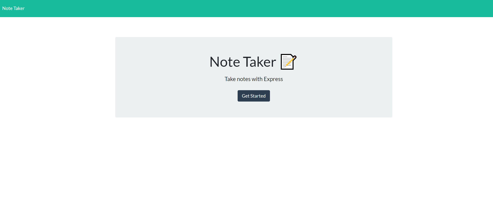

# Note Taker App

## Description
Note taker is an application that allows you to take notes and save them to a server. When ever you come back back to the page your notes will be waiting for you!

## Table of Contents
* [Usage](#usage)
* [Sample](#sample)
* [License](#license)
* [Questions](#questions)

## Usage
Click the new notes button on the top right, give the note a title and description. Once done simply click save!

## Sample
Here is a sample screenshot:

Heroku Website:
https://fast-caverns-74664.herokuapp.com/

## License
Note Taker app is licensed under the MIT License.

## Questions
If you have any question please check out my GitHub https://github.com/ortizjavier10 or email me at ortiz.javier10@gmail.com .
